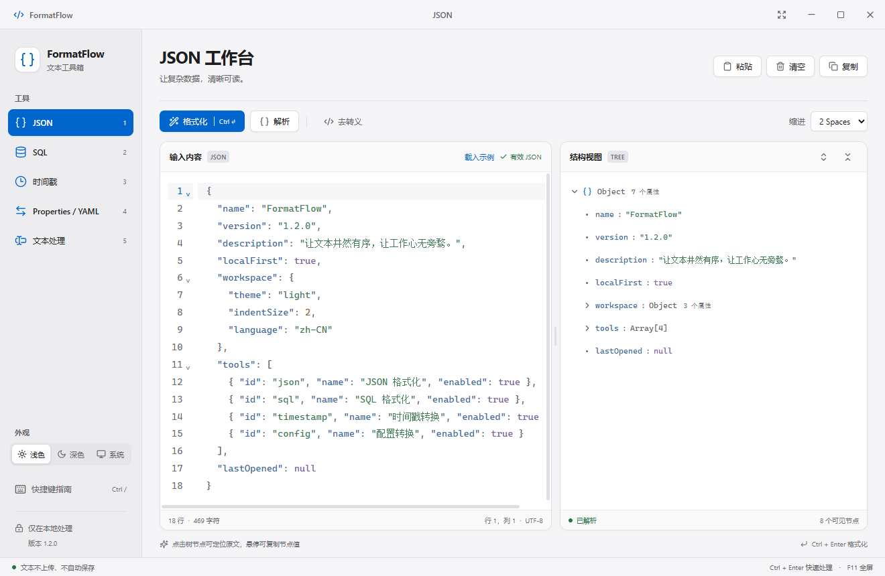
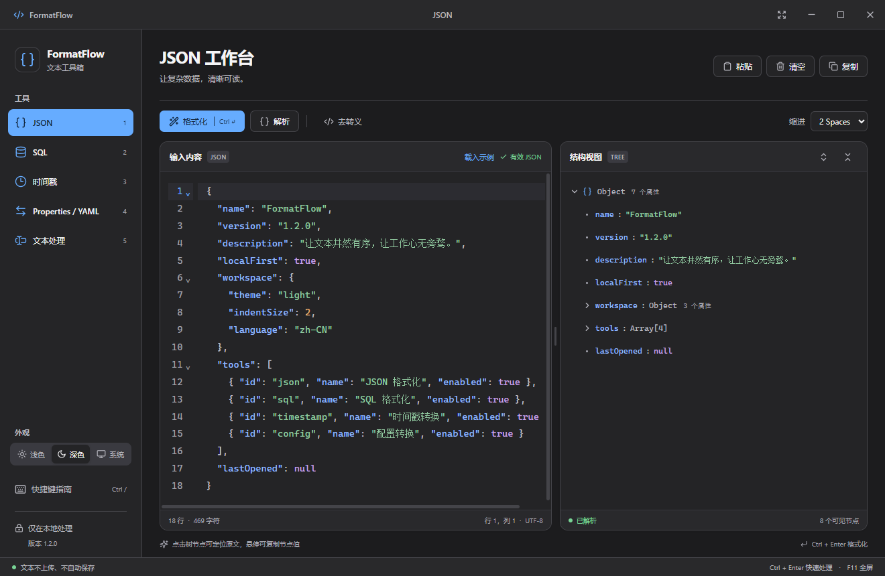

# FormatFlow

面向 Windows 的本地文本处理工作台。参考 Apple Human Interface Guidelines 重构界面，采用紧凑侧栏与双栏编辑布局，支持浅色、深色及跟随系统外观，包含 JSON、SQL、时间戳、Properties / YAML、文本处理五个工具。无需账户，不使用远端文本处理服务，不自动保存输入内容。

## 直接运行

从 [GitHub 最新发行版](https://github.com/LiguoXia/FormatFlow/releases/latest) 下载 Windows x64 便携版，或直接下载 [1.2.0 EXE](https://github.com/LiguoXia/FormatFlow/releases/download/v1.2.0/FormatFlow-1.2.0-win-x64.exe)。发行页同时提供 SHA-256 校验文件和验收记录。

双击 `release/FormatFlow-1.2.0-win-x64.exe`，无需安装 Node.js 或其他运行时。旧版便携 EXE 仍保留在 release 目录，日常使用请打开 1.2.0。

- 面向 Windows 10 / Windows 11 x64；本次实际桌面验证环境为 Windows 11 x64。
- 这是免安装便携包，首次启动会将内置运行文件解压到系统临时目录。`release/win-unpacked/FormatFlow.exe` 可直接启动；移动这一版本时须保留整个 `win-unpacked` 文件夹。
- 当前构建未使用代码签名证书。
- 普通窗口、拖动调整大小、最小化、最大化、真正全屏均已实现，最小窗口为 940 × 640。
- 关闭窗口会退出应用；未保存的文本随之清除。不会隐藏到托盘继续保留文本。

## 功能

### 1.2 界面更新

- 统一语义色、文字层级、圆角、间距、细分隔线和轻量阴影；编辑区使用纯色背景。
- 紧凑侧栏、统一工具栏、分段选择器和更清晰的表单与结果区域。
- 左下角可选择浅色、深色、跟随系统；主题同步覆盖语法高亮、结构树、搜索框、错误提示与选区。
- 外观偏好会保存，切换外观不重建编辑器、不丢失文本或撤销记录。默认浅色。
- 快捷键弹窗支持焦点约束、Esc 关闭和焦点返回；文本分类支持左右方向键、Home / End。
- 适配系统减少动态效果、减少透明度和增强对比度偏好。




### 工具能力

| 工具 | 已实现能力 |
| --- | --- |
| JSON | 2/4 空格格式化、解析、树视图、单层去转义、错误行列提示和定位、节点复制与编辑器定位、全部展开/折叠 |
| SQL | MySQL、PostgreSQL、Oracle / PL/SQL、SQL Server 方言；缩进、关键字大写、JOIN、子查询、CASE 等排版 |
| 时间戳 | 秒级/毫秒级自动识别、双向转换、实时当前时间及复制、Local / UTC / Asia/Shanghai / Asia/Tokyo |
| Properties / YAML | 双向转换、层级路径、数组下标、Java 转义与续行、可选值类型推断、冲突与不支持类型的明确错误 |
| 文本处理 | 26 个一键操作，覆盖压缩与清理、命名与大小写、按行整理、编码与解码；独立结果区、复制结果、结果继续处理 |
| 编辑器 | 统一语法高亮、行号、横向/纵向滚动、清晰的选区背景与已选字符数、查找/替换、撤销/重做、可拖动双栏 |

格式化、粘贴、去转义和清空各自是独立的撤销步骤。切换工具会保留本次运行中的编辑内容。

## 快捷键

| 操作 | 快捷键 |
| --- | --- |
| 格式化 / 配置转换 | Ctrl + Enter |
| 切换五个工具 | Ctrl + 1 / 2 / 3 / 4 / 5 |
| 全屏 / 退出全屏 | F11 / Esc |
| 查找 / 替换 | Ctrl + F / Ctrl + H |
| 撤销 / 重做 | Ctrl + Z / Ctrl + Y；也支持 Ctrl + Shift + Z |
| 复制 / 粘贴 / 剪切 / 全选 | Ctrl + C / V / X / A |
| 快捷键指南 | Ctrl + / |
| 调整双栏 | 拖动分隔线，或聚焦分隔线后按左右方向键 |

## 数据处理约定

### 文本处理（1.1 新增）

分类标签只切换操作列表；点击具体操作立即处理左侧全部输入，结果显示在右侧。`Ctrl + Enter` 再次执行当前选中的操作。输入保持不变；点击“用结果继续处理”可组合下一步，替换输入后支持 Ctrl + Z 撤销。右侧只读结果仍可选中、全选和复制。

| 分类 | 操作 |
| --- | --- |
| 压缩与清理 | JSON 压缩、文本压成一行、去除全部空白、合并多余空格、去除行首尾空白、删除空行 |
| 命名与大小写 | 小驼峰、大驼峰、下划线、短横线、全部大写、全部小写、单词首字母大写、大小写反转 |
| 按行整理 | 去重行、升序、降序、倒置行顺序、添加行号、移除行号 |
| 编码与解码 | URL 编码/解码、Base64 编码/解码、Unicode 转义/还原 |

- JSON 压缩使用语法扫描，保留字符串内空格、转义、大整数和重复键；输入必须是合法 JSON。
- 普通文本压成一行会合并空白，不识别代码语法；JSON 请使用专门的“JSON 压缩”。
- 命名转换支持 `HTTPServer → http_server`、`user_name → userName` 等形式；空格、制表符、下划线和短横线可作为分词边界。标点、换行以及前后保护性下划线会保留。命名转换会修改字符串中的单词，不是代码重构工具。
- 行去重区分大小写和空格，保留首次出现顺序。按行排序使用自然排序，数字按数值排列。行操作保留原有的末尾换行约定，不把文件结束标记当成一条额外记录。
- Base64 使用 UTF-8，支持中文与 Emoji；二进制内容不能直接作为文本解码。URL 编码针对参数值，解码时 `+` 保留为 `+`。
- Unicode 转义处理非 ASCII 字符及控制字符；还原支持 `\\uXXXX` 和 `\\u{码点}`，不解码其他种类的反斜杠转义。

1.1 同时修复了当前行背景遮挡选区的问题：Ctrl + A 的最后一行、鼠标选区以及失焦后的选区均保留背景，编辑器底部显示已选字符数。

### JSON

- 严格标准 JSON：注释、尾逗号、未加双引号的键会报错。
- 格式化采用 token 编辑，保留大整数原始数字、指数写法、重复键与属性顺序。没有通过 `JSON.parse` + `JSON.stringify` 来重写数字。
- 树默认展开根节点以显示第一层属性，嵌套对象/数组默认折叠。子节点只在展开后进入可见列表，界面最多加载约 100 行。
- 复制对象/数组/数字会保留源文本；复制字符串节点得到解码后的字符串值。
- 去转义一次解码一层。带外层引号的 JSON 字符串会去掉外层引号；文本片段也支持 `\"`、`\\`、`\n`、`\r`、`\t`、`\b`、`\f`、`\/` 与 `\uXXXX`。解码后可能是普通文本，不能保证仍是合法 JSON。

### SQL

SQL 只做排版与关键字大小写调整，不执行查询，不连接数据库。方言决定词法与排版规则；存储过程脚本、客户端命令或数据库扩展语法仍可能不被格式化库支持，届时会显示错误并保留原文。

### 配置转换

- Properties 的点分键映射为 YAML 层级；`users[0].name=Tom` 映射为数组。
- 字面键中的点与方括号用反斜杠转义，例如 `a\.b=value` 表示名为 `a.b` 的单个键。这是本工具的路径约定。
- 支持 `=`、`:`、空白分隔符、`#`/`!` 注释、续行与 Unicode 转义。注释及原排版不在转换结果中保留。
- 开启类型识别时，`true` / `false` / `null` 与普通十进制数会转为对应 YAML 值；前导零编号、超出 JavaScript 安全整数范围的 Properties 数字会保留为字符串。关闭后所有值都是字符串。
- Properties 本身没有类型元数据，因此 YAML → Properties → YAML 不能保证所有标量类型完全往返，例如 YAML 字符串 `"true"`。需要保留字符串时关闭类型识别。
- 重复键、标量/层级冲突、稀疏数组、复杂 YAML 键、空对象/数组、循环引用和特殊类型标签会明确报错。避免默默丢失无法表示的数据。
- YAML 解析限制别名展开数，配置层级限制为 128。

## 本地开发

需要 Node.js 22.12+、npm，以及 Windows（打包和桌面验证）。

```powershell
npm ci
npm run desktop
```

其他命令：

```powershell
npm run dev           # 仅启动浏览器界面，用于 UI 开发
npm run build         # TypeScript 检查 + 前端构建
npm test              # 核心转换与数据边界测试
npm run test:desktop  # 对构建后的真实 Electron 窗口做端到端测试
npm run test:text     # 文本处理、鼠标/键盘选择与末行高亮回归
npm run test:ui       # 深浅色、系统外观、布局、焦点、对比度与选区回归
npm run test:portable # 验证当前版本的单 EXE 解压启动
npm run test:performance # 1 MB / 10 MB JSON 与 SQL 性能测试
npm run dist          # 生成 Windows x64 便携 EXE
```

`test:desktop`、`test:text`、`test:ui` 和 `test:performance` 运行前需先 `npm run build`，`test:portable` 需先打包。测试需要关闭正在运行的 FormatFlow（单实例应用）；涉及剪贴板的测试会在结束后恢复原有文本。

对打包后的应用执行同一套桌面检查：

```powershell
$env:FORMATFLOW_TEST_EXE = (Resolve-Path 'release/win-unpacked/FormatFlow.exe').Path
npm run test:desktop
Remove-Item Env:FORMATFLOW_TEST_EXE
```

`npm ci` / 打包首次运行需要联网下载开发依赖；最终应用的文本功能不依赖联网。依赖版本锁定在 `package-lock.json`。应用图标已包含，需重新生成时运行 `powershell -ExecutionPolicy Bypass -File scripts/make-icon.ps1`。

## 结构

```text
electron/                 原生窗口、受限 IPC、剪贴板、网络限制
src/components/           共享编辑器、面板、树视图、分隔线、提示
src/pages/                五个独立工具页面
src/core/                 不依赖 UI 的文本处理逻辑
src/workers/              本地后台处理线程
src/lib/                  Worker 调用、剪贴板、示例数据
src/styles.css            应用样式
src/tokens.css            语义颜色、字体、圆角与主题变量
tests/                    核心逻辑与回归测试
scripts/                  开发、桌面验证、性能验证、图标生成
docs/                     架构和验收记录
release/                  EXE 构建产物（不提交 Git）
```

新增工具可增加 `core` 逻辑、Worker 操作和独立页面，再向导航表注册。UI 与转换逻辑分离。

## 技术与隐私

Electron + React + TypeScript + Vite + CodeMirror 6。核心库为 jsonc-parser、sql-formatter、YAML、Luxon；均随程序打包本地执行。

- JSON / SQL / 配置处理在 Web Worker 中执行；超时 60 秒可取消，编辑输入也会使旧结果失效。
- 不启用 Node renderer integration；启用 context isolation 和 renderer sandbox。
- preload 仅暴露固定窗口操作和文本剪贴板 API，并校验 IPC 来源。
- 生产应用阻止外部网络请求、新窗口与页面导航；没有遥测、更新检查或外部字体。
- 不将输入文本写入历史、收藏、localStorage 或数据库。仅将外观偏好保存到 localStorage。常规 Chromium 运行文件仍可能位于系统应用数据/临时目录中。

实现参考：[Electron 安全指南](https://www.electronjs.org/docs/latest/tutorial/security)、[CodeMirror 文档](https://codemirror.net/docs/)、[SQL Formatter](https://github.com/sql-formatter-org/sql-formatter)。交互参考来自需求中的 [JSON 编辑器](https://www.json.cn/jsonedit/) 与 [时间戳转换](https://tool.lu/timestamp/)。

界面设计参考：[Apple HIG 材质](https://developer.apple.com/design/human-interface-guidelines/materials)、[侧栏](https://developer.apple.com/design/human-interface-guidelines/sidebars)、[排版](https://developer.apple.com/design/human-interface-guidelines/typography)。本应用采用适用于 Windows 的系统字体与 Lucide 图标，并非 macOS 原生控件或 Liquid Glass 原生实现。

历史记录、收藏和多标签不包含在此版本中。
